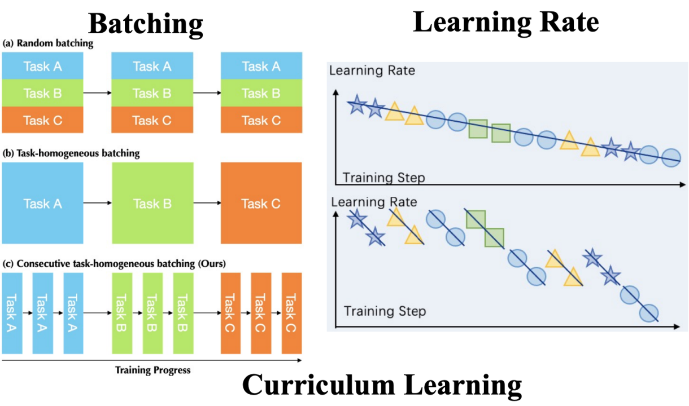
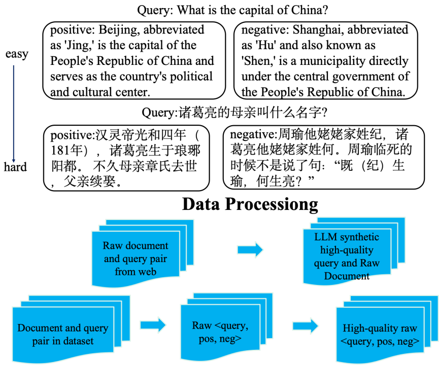
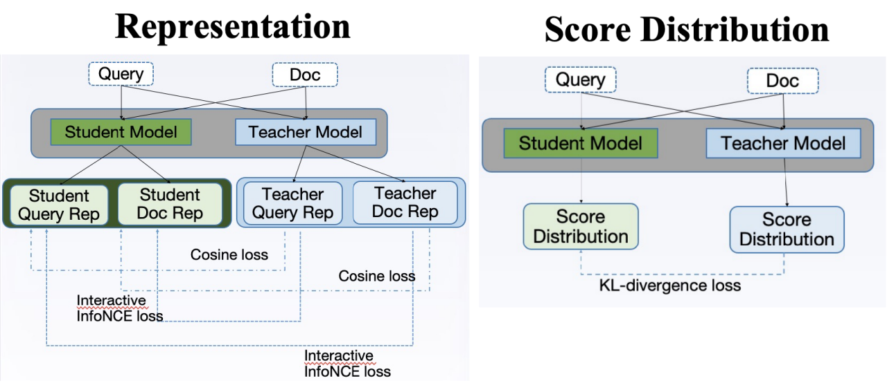
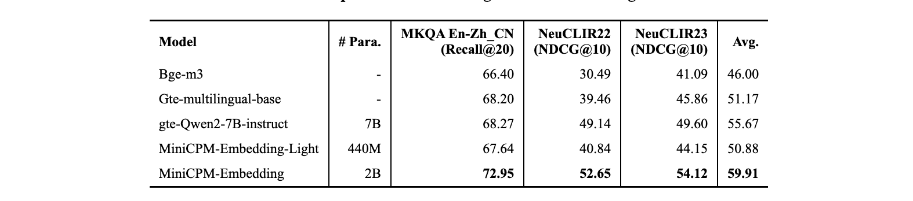
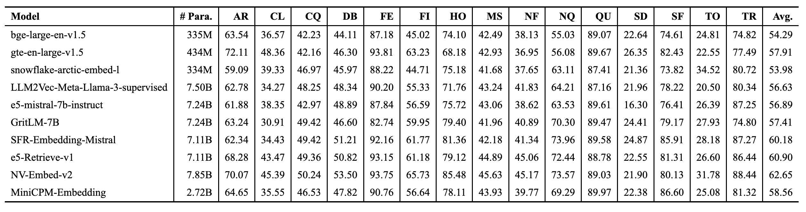
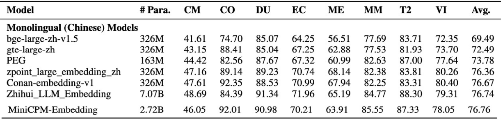

# 检索模型：MiniCPM-Embedding-Light

清小搭背后使用到 MiniCPM-Embedding系列的技术。 MiniCPM-Embedding是面壁智能与清华大学自然语言处理实验室（THUNLP）、东北大学信息检索小组（NEUIR）共同开发的中英双语言文本嵌入模型，共计有两个版本，分别是 MiniCPM-Embedding和轻量级版本MiniCPM-Embedding-Light。他们有如下特点：

- 出色的中文、英文检索能力    
- 优秀的中英跨语言检索能力   
- 支持长文本（最长8192token）   
- 提供稠密向量与token级别的稀疏向量   
- 可变的稠密向量维度（套娃表征）  

其中，MiniCPM-Embedding-Light结构上采取双向注意力和 Weighted Mean Pooling。采取多阶段训练方式，共使用包括开源数据、机造数据、闭源数据在内的约 260M 条训练数据。

## 技术方案
### 同质化小批次的训练方法
MiniCPM-Embedding系列提出一种通过同质化小批次方法，达成稳定且高效的性能提升，对每个数据集，采用不同的调度器，确保在不同任务上表现良好，学习充分，避免灾难性遗忘。  

### 循序渐进的训练方案
通过课程学习，先训练简单样本，再训练困难样本，使得训练稳定；对于文档库小的数据集，训练时直接在全量文档中进行，与真实场景对齐。一些数据集中的查询过于简单，或与文档无关；同一批中的数据中存在假阴性；通过自适应的数据合成与清洗来提升数据质量与数量。  

### 基于蒸馏的模型小型化
为了实现模型小型化，我们通过综合实验分析，我们通过让学生直接学习教师产生的文本表征，使得学生得出的分数分布与教师的分数分布对齐，优化其对文本的表征。

## 实验结果
我们开源的模型与学术界流行的方案在多个任务上做了细粒度的比较，结果显示，MiniCPM-Embedding-Light系列模型在以下多项指标中处于领先地位。

