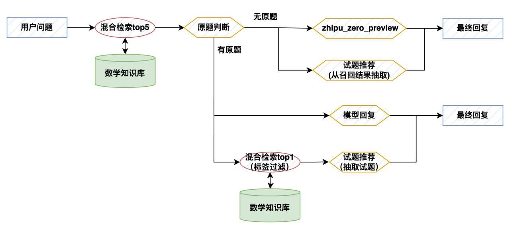

# 数学智能体

数学智能体是一款基于 RAG（检索增强生成）技术打造的专业数学问答系统。它通过融合本地知识库与深度思考能力，为用户提供全方位的数学学习支持。系统主要包含三大核心功能：拍照搜题、智能解答和相关题目推荐。

## 核心功能

### 拍照搜题
系统采用先进的 OCR 技术，能够精准识别图片中的数学题目文本。识别后的内容会自动转换为结构化文本，随后通过 RAG 技术进行深度处理，确保搜题的准确性和效率。

### 智能解答
当用户提出数学问题时，系统首先将问题转化为语义向量，在知识库中进行精确检索。检索到的候选题目集会经过大模型的智能筛选，判断是否存在现成的标准答案。如果找到完整的解答方案，系统会直接提供；若无现成答案，则会调用 DeepSeek R1 等先进的推理模型，为用户生成详细的解题过程。

### 相关题目推荐
系统具备智能的题目推荐机制：
- 当在知识库中找到相关答案时，会基于原题的知识点标签，智能检索并推荐同类知识点的练习题
- 如果原题在知识库中未收录，系统会从首轮检索结果中，通过智能算法筛选合适的题目进行推荐
- 特别设计了去重机制，有效避免相似题目的重复推荐，确保推荐内容的多样性

## 技术架构
   

## 知识库设计
为确保系统输出的高质量和准确性，我们对数学知识库进行了精心设计，构建了一个包含问题描述、详细题解和知识点标签的多维度结构化存储体系。这种设计不仅提升了检索效率，也为智能推荐提供了可靠的数据基础。