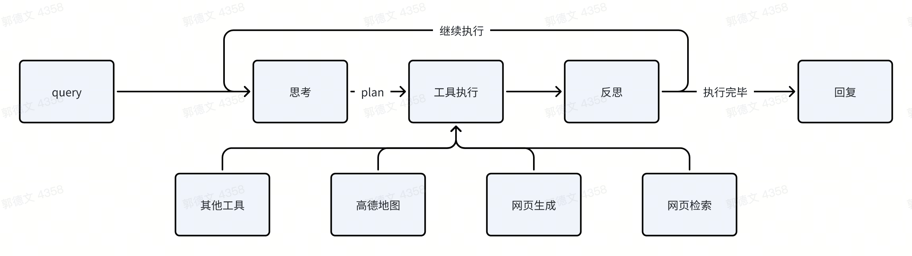

# MCP工具调用系统

清小搭基于先进的智能代理（Agentic）架构，通过系统化的工具调用流程高效处理用户需求。该架构体现了AI系统从需求理解到问题解决的完整认知过程。

## 用户查询处理
系统首先接收并解析用户的具体问题或需求，这构成了整个问题解决流程的基础环节。

## 智能分析阶段
系统在接收用户查询后，进入多维度分析阶段：

- **需求理解**：深入分析用户意图和核心诉求
- **策略评估**：评估外部工具调用的必要性
- **方案设计**：构建问题解决的技术路线

## 执行方案制定
基于分析结果，系统构建结构化的执行方案：

- **工具筛选**：根据需求特征选择适用工具
- **调用编排**：优化工具调用的时序安排
- **参数配置**：完善工具调用的必要参数

## 工具调用执行
作为系统核心功能模块，清小搭提供多样化的工具支持：

**核心工具类别：**

- **高德地图服务**：集成地理位置查询、路线规划、周边搜索等地图功能
- **网络信息检索**：提供实时互联网数据获取能力
- **动态内容生成**：支持智能化网页内容创建
- **专业服务集成**：根据场景需求提供的特定功能服务

## 结果评估机制
工具调用完成后，系统进入全方位评估环节：

- **质量审核**：评估工具调用结果的准确性和完整性
- **目标检验**：验证用户问题的解决程度
- **优化决策**：确定是否需要补充优化方案

## 迭代优化流程
评估阶段可能产生两种处理路径：

**持续优化**：
- 对于未完全解决的问题，系统重启分析流程
- 根据反馈调整执行策略，按需补充工具调用
- 通过迭代循环确保问题得到完整解决

**任务完成**：
- 当评估确认问题解决达到预期时，进入结果输出阶段

## 响应内容生成
系统最终将：   
- **数据整合**：系统化处理多工具调用结果   
- **格式优化**：构建清晰易读的输出格式   
- **方案交付**：提供专业、完整的解决方案   

## 系统特性   
- **智能迭代能力**：采用动态迭代架构，持续优化问题解决方案   
- **工具生态体系**：整合多元化工具服务，满足多样化应用场景    
- **系统化评估**：实施全流程质量管控，确保服务效果   
- **用户体验导向**：始终以用户价值为核心，提供优质服务体验   

通过这套系统化的工具调用框架，清小搭能够模拟人类专家的认知过程，通过分析、规划、执行、评估的闭环机制，高效解决用户的多维度需求，充分展现了现代AI系统的技术价值和实践意义。

## 应用场景
MCP工具调用系统当前主要应用于以下场景：导航路线规划、景点信息推荐、旅游行程定制以及实时资讯获取等场景。
