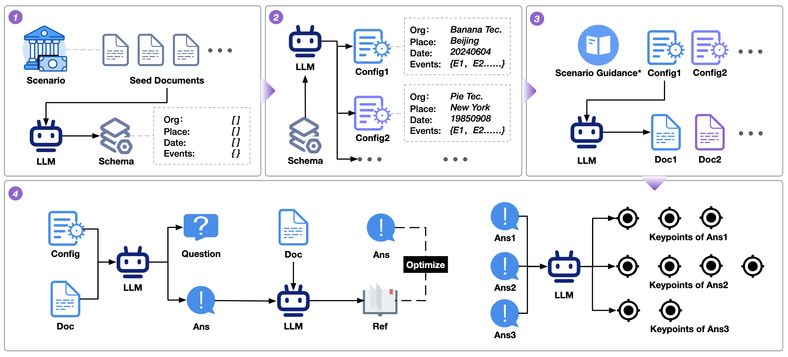
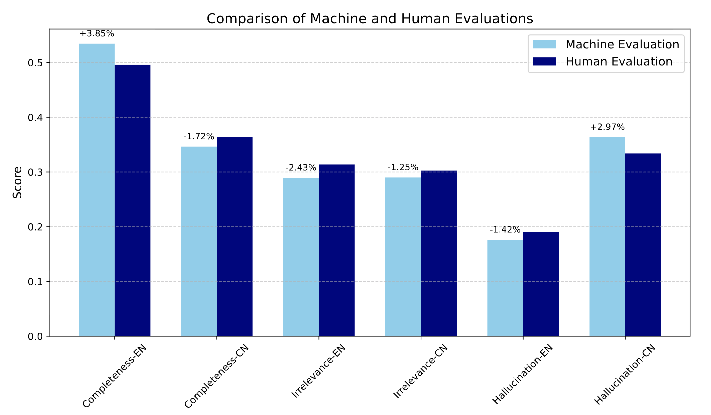

# 评测框架：RAGEval

### 算法背景
检索增强生成（RAG）系统因能将外部知识整合到大型语言模型（LLMs）中，在医疗、金融、法律等对事实准确性要求极高的领域应用广泛。然而，现有RAG系统存在幻觉问题，主要源于检索过程中的噪声及LLMs对检索信息的利用不充分。

当前评估RAG系统的基准存在诸多局限，如场景覆盖不足，缺乏评估事实准确性的全面指标，且构建特定场景评估数据集面临动态现实条件、隐私问题和专家标注成本高等挑战。传统评估指标（如F1、ROUGE-L、BLEU）侧重词汇重叠，难以捕捉长文本生成中的事实准确性和上下文相关性；基于LLMs的评估方法则存在稳定性和可比性问题。

### 算法原理

RAGEval是一个用于生成特定场景RAG评估数据集的框架，核心流程为：   

**Schema摘要生成→配置与文档生成→QRA（Question-Reference-Answer）生成→关键点提取**。

1. **Schema摘要生成**：从种子文档中提炼关键知识，形成抽象结构框架（Schema），涵盖特定领域的核心元素（如医学中的症状、治疗分类），经人工迭代优化确保其全面性、准确性和通用性。   
2. **配置与文档生成**：结合规则方法与LLMs生成配置（为Schema元素赋值），再基于配置生成符合场景的结构化文档，确保内容的事实性和一致性。   
3. **QRA生成**：依据文档和配置生成问题、答案及参考片段，涵盖事实类、多跳推理类等7种问题类型，并通过迭代优化确保答案与参考片段的对齐。   
4. **评估指标**：  
    - **检索指标**：包括召回率（Recall，衡量检索到的参考片段与真实参考的匹配度）和有效信息率（EIR，评估检索片段中相关信息的占比）。    
    - **生成指标**：基于从答案中提取的关键点，定义完整性（Completeness，答案覆盖关键点的比例）、幻觉（Hallucination，答案与关键点矛盾的比例）和无关性（Irrelevance，答案未涉及关键点的比例）。   

### 结论

实验表明，RAGEval生成的样本在清晰度、安全性、一致性和丰富性上优于零样本和单样本方法，且基于LLMs对其提出的指标评分与人类评估一致性高。   

