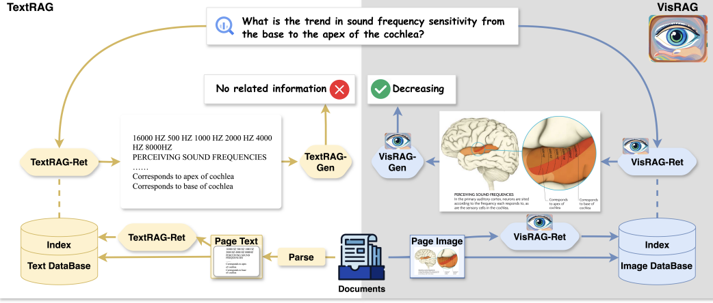

论文地址: https://arxiv.org/abs/2410.10594

模型地址: https://huggingface.co/openbmb/VisRAG-Ret

仓库地址: https://github.com/OpenBMB/VisRAG

##### 方法概述

**UltraRAG-Vis**是一个基于视觉语言模型（VLM）的新型检索增强生成（RAG）管道。与传统的文本解析方法不同，UltraRAG-Vis直接将文档作为图像嵌入，通过VLM进行检索和生成。这种方法最大化了原始文档中数据的保留与利用，避免了传统文本解析过程中可能造成的信息丢失。

**UltraRAG-Vis**的工作流程主要分为两个模块：**检索模块（VisRAG-Ret）** 和  **生成模块（VisRAG-Gen）** 。与传统的文本解析方法不同，UltraRAG-Vis直接利用图像嵌入进行信息检索，避免了传统文档解析（如OCR或文本抽取）过程中可能引入的损失。

###### 1. **VisRAG-Ret：文档检索模块**

VisRAG-Ret模块的核心任务是将输入的查询和文档（图像）转换为嵌入向量。该模块使用MiniCPM-V 2.0模型，集成了SigLIP作为视觉编码器和MiniCPM-2B作为LLM Backbone，从而能同时处理视觉和文本信息。在处理查询和文档时，VisRAG-Ret首先将它们嵌入到共享的向量空间中，并通过相似度计算（例如点积或余弦相似度）来匹配最相关的文档。

* **输入** ：文本查询或图像文档。
* **处理** ：对输入进行视觉编码和语言编码，生成对应的嵌入向量。
* **输出** ：查询和文档的嵌入向量，用于后续的检索和生成任务。

###### 2. **VisRAG-Gen：生成模块**

VisRAG-Gen模块利用由VisRAG-Ret模块检索而来的文档，结合查询生成相应的文本内容。与传统的RAG方法不同，VisRAG-Gen直接使用现成的视觉语言模型（如MiniCPM-V 2.0、MiniCPM-V 2.6和GPT-4o）进行生成任务。

* **输入** ：查询和从检索模块获得的文档。
* **处理** ：将查询和文档作为输入传递给生成模型，通过生成模型生成文本。
* **输出** ：根据输入查询和相关文档生成的文本。

###### 3. **核心特点与优势**

* **无需文档解析** ：**UltraRAG-Vis**直接将文档作为图像输入，避免了传统解析过程中的信息丢失。
* **多模态处理** ：同时处理视觉和语言信息，适应不同类型的文档（如学术文章、图像或图文混排文档）。
* **灵活的生成能力** ：直接使用现有的视觉语言模型进行生成，具有较高的灵活性。
* **提升信息利用率** ：相比于传统的文本解析RAG，**UltraRAG-Vis**通过保留文档的原始视觉信息，最大限度地提高了信息的利用率。