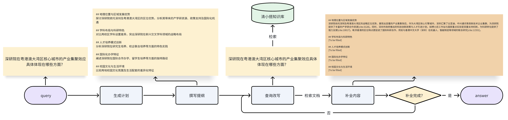

# 智能摘录

## 原理介绍

智能摘录功能是UltraRAG中的算法之一，可以理解成是知识问答的高级演进，它不仅仅是简单的“检索+生成”，更强调 自主的、迭代的、多步骤的推理和探索过程。
它通常结合了代理式RAG的理念，即LLM作为一个“研究代理”，能够自主地规划、执行、评估并调整其研究策略。和清小搭的主干链路（知识问答）相比，智能摘录有以下几个优势：

多步推理和动态规划： 这是智能摘录最核心的优势。它能将复杂问题分解为多个子问题，并为每个子问题制定检索和分析计划。它可以根据中间结果动态调整后续的检索策略和分析方向，类似人类研究员的思维过程。

主动探索和发现： 智能摘录 不仅仅是根据关键词检索，它能主动探索相关概念、寻找潜在的联系、甚至发现新的洞察，超越了简单问答的范畴。

信息综合与交叉验证： 能够从多个来源获取信息，进行复杂的综合、比较和交叉验证，识别信息中的不一致或冲突，从而提供更全面、更可靠的笔记。

更高质量的笔记生成： 最终输出的不仅仅是答案，而通常是结构化、多章节的“笔记”。

智能摘录的主要技术流程是，首先根据用户的问题进行分析，生成一个笔记撰写计划和一个笔记的大纲，然后针对笔记中的每个章节，检索相关信息，并完成章节的撰写，最后结合笔记，生成一个完整的、有深度的答案。下图是一个智能摘录的工作示例。

## 效果展示
为了更加直观的展示清小搭的回答过程，以下给出了一段演示视频。

  <video width="29%" controls style="flex: 3;">
    <source src="../assets/videos/webnote_wx.mp4" type="video/mp4">
    您的浏览器不支持 video 标签。
  </video>

  <video width="71%" controls style="flex: 7;">
    <source src="../assets/videos/webnote_web.mp4" type="video/mp4">
    您的浏览器不支持 video 标签。
  </video>

## 适用场景
智能笔记适用于问题较为开放、宽泛、期望得到系统回复的场景。

