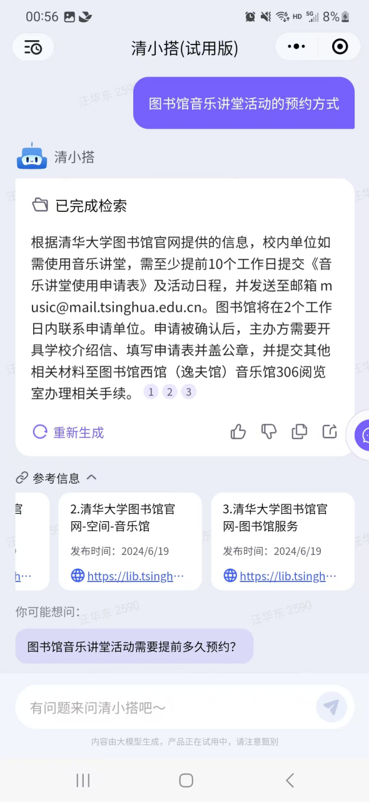
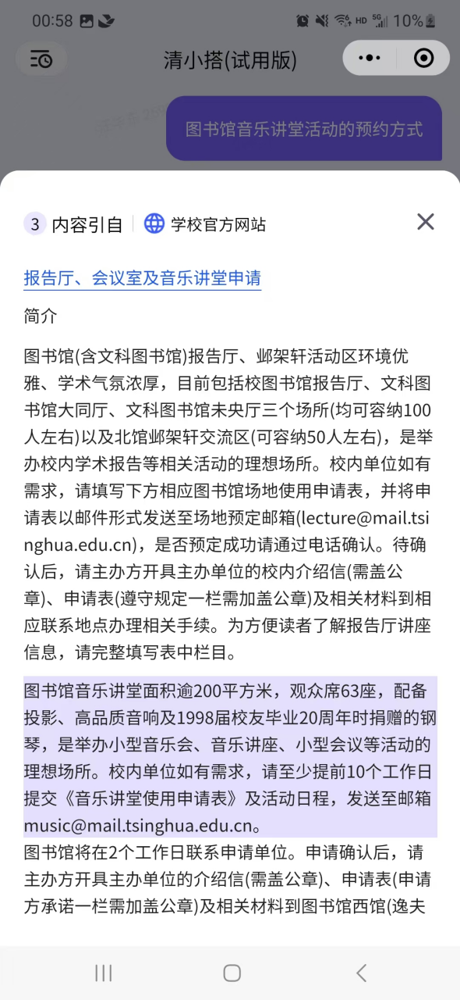

# 清小搭框架介绍

清小搭的算法服务是基于 [UltraRAG](https://github.com/OpenBMB/UltraRAG) 框架开发。基于清华大学的高质量知识库，实现了知识库问答、工具调用和Webnote三大功能，帮助清华学子解决学习和生活中的问题。截至目前，清小搭的问答正确率已经实现了90+%的问答正确率。为了帮助感兴趣的同学深入了解清小搭，现将清小搭的整体框架做个整体上的介绍。

## 知识问答
### 原理介绍
清小搭的知识问答覆盖了检索问答、问题推荐、 来源引用、个性化回复等功能，各自负责的功能为：

- **检索问答：**  明确用户问题，检索清小搭知识库，引用最新的知识片段回答用户问题
- **问题推荐** 根据用户的提问，推荐其后续更加感兴趣的问题
- **来源引用** 对于清小搭的回复，标注名引用的文章来源，并且在源文档高亮参考的文本信息
- **个性化回复** 结合个人成长档案，给出个性化回复

### 效果展示

  <figure style="margin: 0 10px;">
    
    <figcaption style="text-align: center;"> 检索问答 </figcaption>
  </figure>
  <figure style="margin: 0 10px;">
    
    <figcaption style="text-align: center;"> 问题推荐 </figcaption>
  </figure>
  <figure style="margin: 0 10px;">
    
    <figcaption style="text-align: center;"> 引用高亮 </figcaption>
  </figure>
  <figure style="margin: 0 10px;">
    
    <figcaption style="text-align: center;"> 个性化回复 </figcaption>
  </figure>

## 智能摘录

### 原理介绍

智能摘录功能是UltraRAG2.0中的算法之一，可以理解成是知识问答的高级演进，它不仅仅是简单的“检索+生成”，更强调 自主的、迭代的、多步骤的推理和探索过程。
它通常结合了代理式RAG的理念，即LLM作为一个“研究代理”，能够自主地规划、执行、评估并调整其研究策略。和清小搭的主干链路（知识问答）相比，智能摘录有以下几个优势：

多步推理和动态规划： 这是 智能摘录 最核心的优势。它能将复杂问题分解为多个子问题，并为每个子问题制定检索和分析计划。它可以根据中间结果动态调整后续的检索策略和分析方向，类似人类研究员的思维过程。

主动探索和发现： 智能摘录 不仅仅是根据关键词检索，它能主动探索相关概念、寻找潜在的联系、甚至发现新的洞察，超越了简单问答的范畴。

信息综合与交叉验证： 能够从多个来源获取信息，进行复杂的综合、比较和交叉验证，识别信息中的不一致或冲突，从而提供更全面、更可靠的笔记。

更高质量的笔记生成： 最终输出的不仅仅是答案，而通常是结构化、多章节的“笔记”。

智能摘录的主要技术流程是，首先根据用户的问题进行分析，生成一个笔记撰写计划和一个笔记的大纲，然后针对笔记中的每个章节，检索相关信息，并完成章节的撰写，最后结合笔记，生成一个完整的、有深度的答案。下图是一个智能摘录的工作示例。

### 效果展示
为了更加直观的展示清小搭的回答过程，以下给出了一段演示视频。

  <video width="29%" controls style="flex: 3;">
    <source src="assets/videos/webnote_wx.mp4" type="video/mp4">
    您的浏览器不支持 video 标签。
  </video>

  <video width="71%" controls style="flex: 7;">
    <source src="assets/videos/webnote_web.mp4" type="video/mp4">
    您的浏览器不支持 video 标签。
  </video>

### 适用场景
智能笔记适用于问题较为开放、宽泛、期望得到系统回复的场景。

## MCP工具调用
清小搭采用了先进的智能代理（Agentic）架构，通过迭代式的工具调用流程来高效解决用户问题。整个流程体现了AI从理解问题到最终回复的完整思考与执行过程。
### 用户查询接收
流程始于用户向清小搭提出具体问题或需求。系统会接收并解析用户的查询内容，这是整个问题解决过程的起点。

### 智能思考阶段
接收到用户查询后，清小搭会进入深度思考阶段：
- **问题分析**：理解用户真实意图和核心需求
- **策略制定**：判断是否需要调用外部工具
- **方案规划**：确定解决问题的整体思路和方法

### 执行计划制定
基于思考结果，系统会生成具体的执行计划：
- **工具选择**：确定需要使用哪些工具
- **执行顺序**：规划工具调用的先后顺序
- **参数准备**：准备工具调用所需的参数信息

### 工具执行阶段
这是流程的核心环节，清小搭会根据计划调用相应的工具：

**可用的工具类型包括：**
- **高德地图服务**：提供地理位置查询、路线规划、周边搜索等功能
- **网页检索工具**：从互联网获取最新信息和数据
- **网页生成工具**：创建和生成网页内容
- **其他专业工具**：根据具体需求调用的各种专业服务

### 结果反思阶段
工具执行完成后，清小搭会进入反思阶段：
- **结果评估**：分析工具执行的结果质量
- **问题诊断**：判断是否完全解决了用户问题
- **策略调整**：决定是否需要进一步优化或补充

### 迭代优化机制
反思阶段会产生两种结果：

**继续执行**：
- 如果问题尚未完全解决，系统会重新进入思考阶段
- 调整执行策略，可能需要调用其他工具或优化参数
- 形成迭代循环，直到问题得到充分解决

**执行完毕**：
- 当反思确认问题已得到满意解决时，流程进入最终阶段

### 用户回复生成
最后，清小搭会：
- **信息整合**：将多个工具的执行结果进行综合处理
- **内容优化**：生成用户友好的回复格式
- **结果交付**：向用户提供完整、准确的解决方案

### 技术特点与优势

**智能迭代**：整个流程采用迭代式设计，能够根据中间结果动态调整策略，确保问题得到最优解决。

**工具多样性**：集成了地图服务、网络检索、内容生成等多种工具，覆盖用户的各种需求场景。

**反思机制**：内置的反思环节确保每次工具调用都有明确的目标和效果评估。

**用户导向**：整个流程始终以解决用户问题为核心，提供高质量的服务体验。

通过这套完整的工具调用流程，清小搭能够像人类专家一样，通过思考、规划、执行、反思的循环过程，智能地解决用户的各种复杂问题，体现了现代AI系统的先进性和实用性。

### 应用场景
MCP工具调用的场景和可用的工具有关，目前适用的场景是路线导航、景点推荐、旅游规划以及实时新闻查询等类型的问题。
