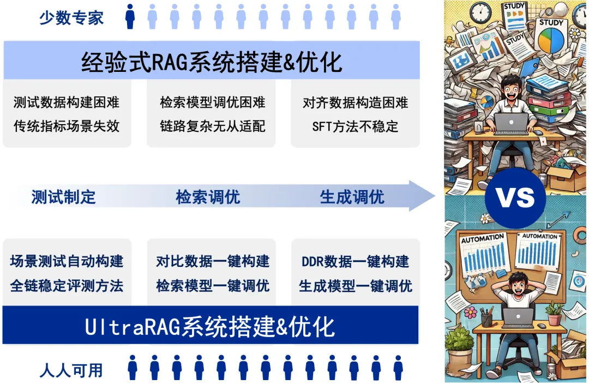
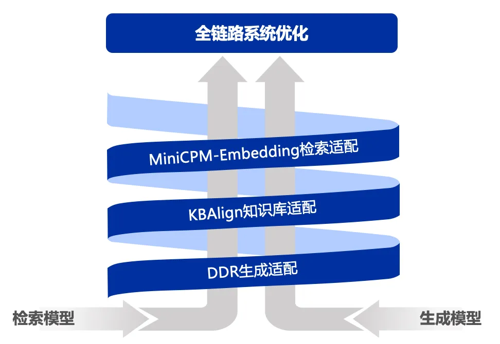
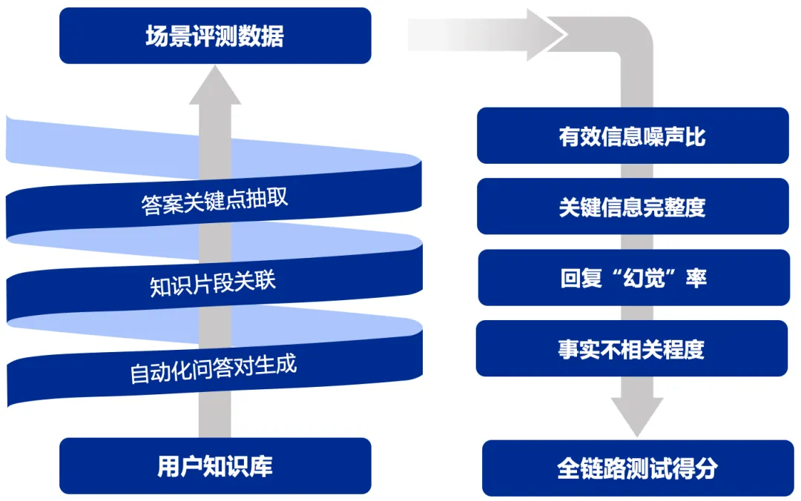
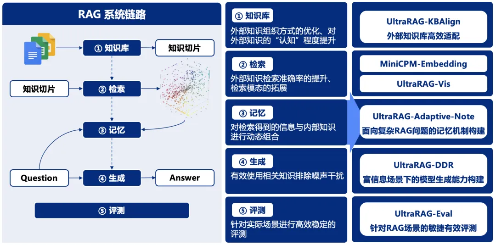

# 清小搭算法框架: [UltraRAG](https://github.com/OpenBMB/UltraRAG)

## 背景介绍
RAG系统的搭建与优化是一项庞大且复杂的系统工程，通常需要兼顾测试制定、检索调优、模型调优等关键环节，繁琐的工作流程往往让人无从下手。对此，我们推出了UltraRAG框架，该框架革新了传统RAG系统的开发与配置方式，不仅具备满足专业用户需求的“单反相机”级精细化配置能力，同时也提供类似“卡片机”的一键式便捷操作，让RAG系统的构建变得极简且高效，极大降低了学习成本和开发周期。

    

## 技术特点
- UltraRAG更加关注将模型适配到用户提供的知识库，有效避免在“模型选型”的反复纠结。其模块化设计又能为科研需求快速赋能，帮助研究者在多种场景下自由组合、快速迭代。   
- 通过UltraRAG，用户可以轻松完成从数据到模型的全流程管理。此外还有一系列 RAG 技术全家桶，例如：RAG-DDR、VisRAG，提供更加完备的解决方案。   
- 零代码编程WebUI支持，一键式系统化数据构建UltraRAG以其极简的WebUI作为核心优势之一，即便是无编程经验的用户，也能轻松完成模型的构建、训练与评测。   
- 无论是快速开展实验，还是进行个性化定制，UltraRAG均能提供直观且高效的支持。该框架集成了多种预设工作流，用户可根据具体需求灵活选择最优路径，无需编写繁琐代码，即可完成从数据处理到模型优化的全流程操作。   

## 零代码编程WebUI支持
UltraRAG 以其极简的 WebUI 作为核心优势之一，即便是无编程经验的用户，也能轻松完成模型的构建、训练与评测。无论是快速开展实验，还是进行个性化定制，UltraRAG均能提供直观且高效的支持。该框架集成了多种预设工作流，用户可根据具体需求灵活选择最优路径，无需编写繁琐代码，即可完成从数据处理到模型优化的全流程操作。以下是效果演示：

## 合成与微调“一键式”解决
UltraRAG以自研的KBAlign、DDR等方法为核心，提供“一键式”数据构建，结合检索与生成模型的多样化微调策略，助力性能全面优化。   
在数据构造方面，UltraRAG覆盖从检索模型到生成模型的全流程数据构建方案，支持基于用户导入的知识库自动生成训练数据，显著提升场景问答的效果与适配效率。   
在模型微调方面，UltraRAG提供了完备的训练脚本，支持Embedding模型训练及LLM的DPO/SFT微调，帮助用户基于数据构建更强大、更精准的模型。   

    

## 多维多阶段稳健式评估
UltraRAG以自研的UltraRAG-Eval方法为核心，融合针对有效与关键信息的多阶段评估策略，显著提升模型评估的稳健性，覆盖从检索模型到生成模型的多维评估指标，支持从整体到各环节的全面评估，确保模型各项性能指标在实际应用中得到充分验证。     
通过关键信息点锚定，UltraRAG有效增强评估的稳定性与可靠性，同时提供精准反馈，助力开发者持续优化模型与方法，进一步提升系统的稳健性与实用性。    

    

## 科研友好探索工作集成
UltraRAG内置THUNLP-RAG组 自研方法及其他前沿RAG技术，支持整个模块化的持续探索与研发。UltraRAG不仅是一个技术框架，更是科研人员与开发者的得力助手，助力用户在多种任务场景中高效寻优。随着功能的不断完善与升级，UltraRAG将在更广泛的领域和应用场景中发挥关键作用，持续拓展RAG技术的应用边界，推动从学术研究到商业应用的全面发展。其简洁、高效、灵活且易于上手的特性，使RAG框架的部署与应用更加便捷，显著降低科研与项目开发的技术复杂度，帮助用户专注于创新与实践。

    

## UltraRAG内置探索技术系列
UltraRAG系列引入以下多项创新技术，优化了检索增强生成中的知识适配、任务适应和数据处理，提升了系统的智能性和高效性。
<table style="width: 100%; border-collapse: collapse; margin: 20px 0; font-family: 'Segoe UI', Tahoma, Geneva, Verdana, sans-serif; box-shadow: 0 4px 8px rgba(0,0,0,0.1);">
  <thead>
    <tr style="background: linear-gradient(135deg, #667eea 0%, #764ba2 100%); color: white;">
      <th style="padding: 15px 20px; text-align: left; font-weight: 600; font-size: 16px; border-bottom: 3px solid #5a67d8;">算法</th>
      <th style="padding: 15px 20px; text-align: left; font-weight: 600; font-size: 16px; border-bottom: 3px solid #5a67d8;">说明</th>
    </tr>
  </thead>
  <tbody>
    <tr style="background-color: #f8fafc; border-bottom: 1px solid #e2e8f0;">
      <td style="padding: 15px 20px; font-weight: 600; color: #2d3748; border-right: 1px solid #e2e8f0;">UltraRAG-KBAlign</td>
      <td style="padding: 15px 20px; color: #4a5568; line-height: 1.6;">提升大语言模型自适应知识库的能力，优化知识检索与推理过程。2.4B模型通过自标注达到GPT-4o的标注性能，并在多个实验中超越GPT-4o本身。</td>
    </tr>
    <tr style="background-color: #ffffff; border-bottom: 1px solid #e2e8f0;">
      <td style="padding: 15px 20px; font-weight: 600; color: #2d3748; border-right: 1px solid #e2e8f0;">UltraRAG-Embedding</td>
      <td style="padding: 15px 20px; color: #4a5568; line-height: 1.6;">出色的中英文检索能力，支持长文本与稀疏检索，通行评测榜单MTEB-Retrieval上性能评分超过BGE-M3的10%。</td>
    </tr>
    <tr style="background-color: #f8fafc; border-bottom: 1px solid #e2e8f0;">
      <td style="padding: 15px 20px; font-weight: 600; color: #2d3748; border-right: 1px solid #e2e8f0;">UltraRAG-Vis</td>
      <td style="padding: 15px 20px; color: #4a5568; line-height: 1.6;">提出了纯视觉的RAG Pipeline，通过引入VLMs对文档进行编码，避免了文档解析造成的信息丢失，相比传统Text RAG Pipeline，部分任务在端到端性能上提升25-39%。</td>
    </tr>
    <tr style="background-color: #ffffff; border-bottom: 1px solid #e2e8f0;">
      <td style="padding: 15px 20px; font-weight: 600; color: #2d3748; border-right: 1px solid #e2e8f0;">UltraRAG-Adaptive-Note</td>
      <td style="padding: 15px 20px; color: #4a5568; line-height: 1.6;">通过动态记忆管理和信息收集，提升复杂问答任务中的解答质量。在GPT-3.5-turbo、Llama3-8B、Qwen2-7B等多个前沿模型上实验表明，自适应地动态记忆管理和信息收集策略相较基础检索增强生成模型实现3%～13.9%的性能提升，并且尤其擅长处理具有复杂信息检索需求的问题。</td>
    </tr>
    <tr style="background-color: #f8fafc; border-bottom: 1px solid #e2e8f0;">
      <td style="padding: 15px 20px; font-weight: 600; color: #2d3748; border-right: 1px solid #e2e8f0;">UltraRAG-DDR</td>
      <td style="padding: 15px 20px; color: #4a5568; line-height: 1.6;">基于可微调数据奖励(DDR)优化检索增强生成，提升任务特定场景的系统性能。在MiniCPM-2.4B、Llama3-8B等多个前沿模型上实验表明，DDR优化策略相较原始检索增强生成模型可实现7%以上性能提升。</td>
    </tr>
    <tr style="background-color: #ffffff;">
      <td style="padding: 15px 20px; font-weight: 600; color: #2d3748; border-right: 1px solid #e2e8f0;">UltraRAG-Eval</td>
      <td style="padding: 15px 20px; color: #4a5568; line-height: 1.6;">针对RAG场景设计的高效评测方案。通过少量种子文档，快速自动生成专业领域的RAG评测数据，并提供稳健的模型驱动评测指标与方法。</td>
    </tr>
  </tbody>
</table>   

